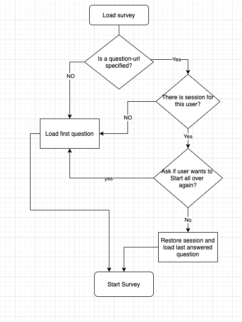

# Visibility Check

A lightweight survey application that helps researchers self‑assess their online visibility. It consists of a React frontend and a Laravel (PHP) backend with a MariaDB database.

## Index
- [Overview](#overview)
- [Technology Stack](#technology-stack)
- [Requirements](#requirements)
- [Getting Started](#getting-started)
  - [Run with Docker Compose](#run-with-docker-compose)
  - [Manual Backend Setup](#manual-backend-setup)
  - [Frontend Development (Local)](#frontend-development-local)
- [Configuration](#configuration)
  - [Frontend Environment Variables](#frontend-environment-variables)
  - [API URL and PHP Proxy](#api-url-and-php-proxy)
  - [How Configuration Is Loaded](#how-configuration-is-loaded)
- [Admin App](#admin-app)
- [User Session and Progress](#user-session-and-progress)
- [NPM Scripts](#npm-scripts)
- [Learn More](#learn-more)

## Overview
Visibility Check enables researchers to answer a set of questions about their online presence. Answers are stored **anonymously** via the backend API; Administrators can manage the survey content via the admin interface.

## Technology Stack
- Frontend: React, Material UI
  - https://create-react-app.dev/
  - https://reactjs.org/
  - https://mui.com/ (formerly material-ui.com)
  - https://nginx.org
  
- Backend: PHP (Laravel), MariaDB
  - https://laravel.com/
  - https://mariadb.com/
  - https://www.php.net/
  - https://httpd.apache.org/

## Requirements
- Docker and Docker Compose (recommended), or
- Node.js (for local frontend development)
- PHP 8.2 and Composer (for backend), MariaDB 12

## Getting Started

### Run the apps with Docker Compose
A `docker-compose.yaml` is provided to build and run the full stack. On the first run, the **database will be created and seeded automatically**.
The backend app is mounted as a volume, so changes to the code will be reflected immediately in the running container.
The stack is configured to run on port 8088 for the frontend and 8089 for the admin app

1. Install Docker and Docker Compose.
2. Install composer
3. In the backend/ directory run 
   ```bash
    composer install
   ```
4. From the project root, start the docker stack. This will build the frontend app and the backend app.
   ```bash
   docker compose up --build
   ```
5. You will now have a running application, you can access the apps:   
   - Frontend: http://localhost:8089
   - Admin: http://localhost:8088/admin
   - API base URL: http://localhost:8088/api
   
### Admin App
1. Open the admin UI: http://localhost:8088/admin
2. Log in with the default credentials:
    - Email: `test@example.com`
    - Password: `password`

Change these credentials immediately in any non-test environment.


## Manual Backend Setup
Only needed if you do not use Docker and prefer running locally or on your own server.

1. Create the database and set connection details in `backend/.env`.
2. Run migrations to create tables (in backend/ directory):
   ```bash
   php artisan migrate
   ```
3. Seed the database with initial content (in backend/ directory):
   ```bash
   php artisan db:seed
   ```

## Frontend Development (Local)
To further deevelop and customize the app you can run the React dev server for a fast feedback loop; the server rebuilds on file save. 

1. Install Node.js
2. Go to the frontend directory: 
   ``` bash 
   cd frontend
   ```
2. Install JS dependencies:
   ```bash
   npm install
   ```
3. If needed adjust the configuration in  `frontemd/.env.development`:

5. Start the React dev server:
   ```bash
   npm start
   ```
6. Develop as usual; the dev server auto-reloads on save.

## Configuration

### Frontend Environment Variables
The frontend dev and production build uses the REACT_APP_ prefix for environment variables. Refer to the react-app manual for more information: https://create-react-app.dev/docs/adding-custom-environment-variables/

Two variables are needed:
- `REACT_APP_API_URL`: Base URL of the API that serves questions and stores answers.
- `REACT_APP_FEEDBACK_FORM_URL`: URL of the external feedback form that is displayed at the end of the survey.


### Backend Configuration
The backend is configured via the `.env` file in the backend/ directory.
This configuration follows the normal Laravel configuration format.

### Adding Users
This app has a minimal user management. Users can be added via the admin app.

https://localhost:8088/register

## Backend Production build 
A prod.Dockerfile is provided as an example to build a production-ready Docker image.
This Dockerfile import the laravel dependencies first with a composer container and then copies the source code to a new PHP/Apache container.


## Visibility Survey User Session and Progress

The user session is stored in the database and is managed by the backend. 
The session is identified by a unique session ID and is only attached to the user's browser. **No personal data is stored**



## NPM Scripts
In the project directory, you can run:

### `npm start`
Runs the app in development mode and opens http://localhost:3000. The page reloads on edits and displays lint errors in the console.

### `npm test`
Launches the test runner in watch mode. See Create React App docs for details.

### `npm run build`
Builds the app for production to the `frontend/build` folder. React is bundled in production mode and optimized for performance. Filenames include content hashes.

### `npm run eject`
Note: this is a one-way operation. Once you eject, you cannot go back.

If the default configuration is insufficient, `eject` will copy all config files and dependencies (Webpack, Babel, ESLint, etc.) into your project so you have full control. All commands except `eject` will continue to work, but they will reference the copied scripts.

## Learn More
- Create React App: https://facebook.github.io/create-react-app/docs/getting-started

